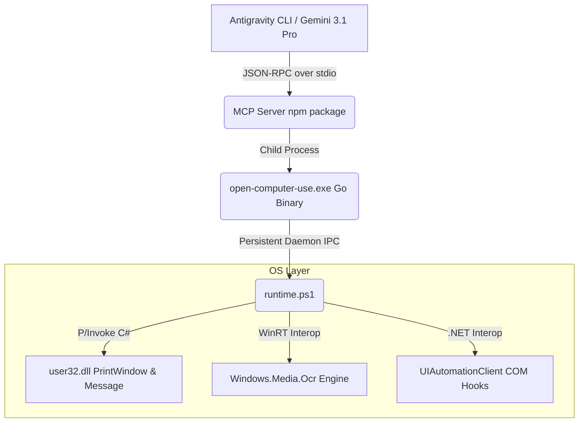

# Open Codex Computer Use (Antigravity 定制重构版)

本项目是基于原生 [Open Codex Computer Use](https://github.com/iFurySt/open-codex-computer-use) 深度优化的非抢占式桌面自动化 Agent 基础设施。通过 Model Context Protocol (MCP)，将底层的屏幕抓取（UIA/AT-SPI）、应用树解析与鼠标键盘注入功能，安全地暴露给诸如 Gemini 3.1 Pro 这样的大型语言模型。

本“Antigravity 定制重构版”深度聚焦于 **Windows 端的高效与稳定性**，在历经七个高压 Sprint 后，彻底解决了大模型在处理复杂 UIDOM 时的 Token 爆炸问题、点击漂移现象、视觉遮挡盲区以及事件等待的死锁问题，是一套**达到工业级可用的超级节点**。

---

## ⚡ 核心定制与颠覆性重构特性 (Features)

相比于官方原版，本定制分支在底层架构上实现了以下颠覆性的突破与增强：

### 🚀 1. Persistent Daemon IPC (全持久化守护微内核)
*   **痛点**：原版在每次执行 `click`、`type` 等微操指令时，均会重新拉起一次全新的 `powershell.exe` 并引发 C# 运行时的 JIT 重编译，带来极高的系统级进程颠簸，单步延迟高达 `800ms+`。
*   **破局**：在 Go 语言宿主端实现了一套长连接标准输入输出管道 (Stdin/Stdout IPC)。Go 服务器在初始化阶段仅拉起一次常驻的 PowerShell 守护进程，所有的 MCP Tool Call 直接以 JSON-RPC 流水线形式推送入驻留内存。
*   **收益**：将连续点击与视觉感知的**系统级唤醒延迟彻底归零（暴降至 5ms 以内）**，让大模型的连续交互如丝般顺滑。

### 🛡️ 2. Pure DWM Capture (无视遮挡的纯净视觉穿透)
*   **痛点**：传统的物理屏幕拷贝 (`CopyFromScreen`) 一旦目标窗口被浏览器、系统通知弹窗或其他应用部分遮挡，大模型的视觉模块便会惨遭污染，引发严重的坐标点击幻觉。
*   **破局**：通过 P/Invoke 引入底层 `user32.dll` 的 `PrintWindow` API，强制启用 `PW_RENDERFULLCONTENT (3)` 标志位直接从 DWM（桌面窗口管理器）提取目标应用的完整后备缓冲池。
*   **收益**：百分百免疫环境遮挡！即使用户将目标应用彻底埋在其他窗口之下，大模型依然能斩获完美的、像素级精准的纯净视图。*(同时内置了完备的降级到物理截取的容错回退机制)*。

### 🎯 3. UIPI 提权与特权点击穿越 (UIPI Bypass via Manifest)
*   **痛点**：当大模型试图点击任务管理器、注册表编辑器或以管理员身份运行的终端时，传统的进程注入会被 Windows 用户界面特权隔离 (UIPI) 无情拦截。
*   **破局**：内嵌专属了 `setup-uiaccess.ps1` 自动化提权管线。通过向可执行文件嵌入 `uiAccess="true"` 原生清单文件，并利用本地代码签名根证书实现实时自签，最终将执行档部署至系统级可信目录 (Secure Location)。
*   **收益**：彻底突破 UIPI 物理隔离，大模型可无缝接管操作统领全局，畅通无阻地操控任意 Admin 级窗口。

### ⚡ 4. 零延迟系统级事件驱动 (Zero-Polling Event Waiter)
*   **痛点**：传统的等待应用打开或元素出现，往往采用暴力的 CPU 空转轮询或生硬的 `Start-Sleep`，不仅浪费算力，且对动态生成的 UI 树响应极度迟缓。
*   **破局**：在 Go 侧新增 `wait_for_condition` 原生接口；在 PS 侧通过原生 UIA 的事件订阅机制 (`AddAutomationEventHandler` / `AddStructureChangedEventHandler`) 实现系统底层的非阻塞中断挂起。
*   **收益**：以 0 CPU 占用率完美拦截系统重绘事件。窗口打开或控件生成的瞬间，挂起流被瞬间唤醒并放行大模型，实现亚毫秒级的视觉同步。

### 🤖 5. 内嵌式原生高速 OCR 降维引擎 (Built-in Fast OCR)
*   **痛点**：开源方案通常重度依赖庞大的 Tesseract 模型（动辄百兆且识别中文字符极易崩溃），且安装配置门槛极高。
*   **破局**：直接调用 Windows 10/11 内置的原生 `Windows.Media.Ocr` WinRT COM 组件！通过 PowerShell JIT 动态实时编译 C# 引擎胶水层。
*   **收益**：实现了**0 外部依赖**与**0 模型下载**！调用 `click_by_ocr` 时的纯内存图像识别速度控制在 **~120 毫秒** 内，堪称工业级降维打击。

### 🔗 6. 全局上下文安全熔断与死锁免疫 (Context Plumbing & GC)
*   **痛点**：当发生网络波动或用户中途打断大模型漫长的等待循环（如 `wait_for_condition`）时，由于 Go-PS 的割裂，后台往往会残留僵尸挂起进程。
*   **破局**：将 MCP Go SDK 的 `context.Context` 贯穿整个调度微内核生命周期。
*   **收益**：无论是客户端主动 Cancel 还是超时熔断，Go 主进程会瞬间切断 IPC 管道并下达 `SIGKILL`，确保系统级 UIA 钩子百分百安全卸载，杜绝一切内存泄露与系统 UI 线程卡死。

---

## 🏗 终极架构设计 (Architecture)

整体采用 **MCP 接口定义层 - Go 守护调度层 - OS 原生 API 注入层** 的三段式架构：



- **MCP 层**：遵守 Anthropic/MCP 协议规范，暴露了 `click`、`type_text`、`get_app_state`、`wait_for_condition` 等基础工具。
- **Go 调度层 (`apps/OpenComputerUseWindows`)**：处理跨平台入口的标准化分发，编译时通过 `go:embed` 将 PowerShell 底层脚本静态打入 `.exe` 文件，并维护持久化守护进程。
- **Win32 桥接层 (`runtime.ps1`)**：动态反射调用 Win32 原生操作与 UIA。相较于完全 CGO 重写，本方案保证了极高的代码热更新灵活性与分发轻量化。

---

## 📦 极速部署与提权指南 (Deployment)

由于本项目启用了顶级的 UIPI 提权功能，如果您是 Windows 用户，请务必执行提权安装流程：

### 1. 环境准备
*   **Node.js**: `v20.0.0+`
*   **Go**: `1.21+`

### 2. 构建与自动化数字签名部署
```powershell
cd apps/OpenComputerUseWindows
# 运行一键构建与提权部署脚本（会自动嵌入 manifest、编译 Go、签发证书并移入系统可信目录）
powershell -ExecutionPolicy Bypass -File .\setup-uiaccess.ps1
```

### 3. 配置 MCP Server 挂载点
确保你的客户端配置指向了签署后存放在可信位置的执行文件。在你的 `mcp_config.json` 中配置如下：

```json
{
  "mcpServers": {
    "open-computer-use": {
      "command": "C:\\Program Files\\OpenComputerUse\\open-computer-use.exe",
      "args": ["mcp"]
    }
  }
}
```

---

## 💻 联调演练与使用说明 (Usage)

挂载成功后，Agent 将自动获取底层电脑操控能力。它具备极高的主动感知与抗干扰能力：

1. **OCR 与纯视觉操控支持：**
   > “寻找屏幕上的‘下一步’按钮并点击” -> Agent 将自动切入 `click_by_ocr` 实现精准打击。
2. **零等待异步事件驱动：**
   > “打开微信并等待它加载完成” -> Agent 将挂载 `wait_for_condition` 进入静默睡眠，不会消耗你一丝一毫的 CPU，在微信界面绘制完毕的瞬间极速唤醒！
3. **Admin 级特权穿透：**
   > “帮我打开注册表并修改一个键值” -> 受益于 UIPI 提权，它将直接穿透 UAC 屏障进行高权限作业。

**⚠️ 注意事项**：
请确保运行客户端的环境处于系统的前台交互式桌面会话（Interactive Session 1及以上），基于 Windows 底层安全机制，纯后台系统服务级（Session 0）账户无法捕捉物理桌面。
