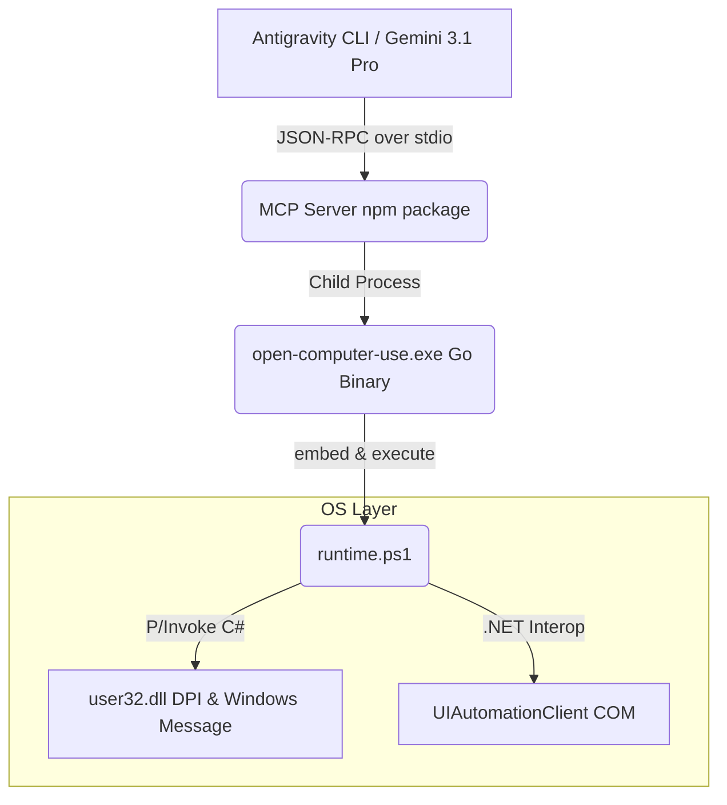

# Open Codex Computer Use (Antigravity 定制版)

本项目是基于原生 [Open Codex Computer Use](https://github.com/iFurySt/open-codex-computer-use) 深度优化的非抢占式桌面自动化 Agent 基础设施。通过 Model Context Protocol (MCP)，将底层的屏幕抓取（UIA/AT-SPI）、应用树解析与鼠标键盘注入功能，安全地暴露给诸如 Gemini 3.1 Pro 这样的大型语言模型。

本“Antigravity 定制版”深度聚焦于 **Windows 端的高效与稳定性**，彻底解决了大模型在处理复杂 UIDOM 时的 Token 爆炸问题与点击漂移现象。

---

## ⚡ 核心定制特性 (Features)

相比于官方原版，本定制分支实现了以下关键突破：

1. **零宽与离屏元素暴力剪枝 (Aggressive Token Pruning)**：
   自动拦截深度大于 2 级的 `IsOffscreen` 节点及无实体尺寸节点。针对 VS Code、浏览器等 Electron 级重度 DOM 树应用，将大模型的视觉序列化 Token 消耗降低 50% - 80%。
2. **DPI 物理像素对齐 (True DPI Awareness)**：
   强制注入并激活 `SetProcessDPIAware()`。大模型从截图中计算的物理坐标，将不受系统 150%/200% 缩放率的干扰，彻底消灭“指东打西”的点击漂移 bug。
3. **扩展组合键谱 (Expanded Keymap)**：
   补齐了 Windows 运行时下的标准符号映射（`[`、`=` 等）与多媒体/系统控制键（`volume_up`、`print_screen`），与 Linux xdotool 语义实现大一统。
4. **Session 0 防盲区感知 (Headless Service Protection)**：
   针对作为系统守护进程启动的 CLI 环境，自动嗅探 `SessionId`。当因为 Session 隔离而无法读取桌面 UI 时，主动抛出警告，防止大模型陷入“幻觉”。

---

## 🏗 架构设计 (Architecture)

整体采用 **MCP 接口定义层 - Go 守护调度层 - OS 原生 API 注入层** 的三段式架构：



- **MCP 层**：遵守 Anthropic/MCP 协议规范，暴露了 `click`、`type_text`、`get_app_state` 等 9 个基础工具。
- **Go 调度层 (`apps/OpenComputerUseWindows`)**：处理跨平台入口的标准化分发，编译时通过 `go:embed` 将 PowerShell 底层脚本静态打入 `.exe` 文件。
- **Win32 桥接层 (`runtime.ps1`)**：通过 C# `[DllImport]` 动态反射调用 Win32 原生 `SendMessage` 与 `UIAutomationClient`。相较于完全 CGO 重写，本方案保证了极高的代码热更新灵活性与分发轻量化。

---

## 📦 部署指南 (Deployment)

作为 Antigravity CLI 的专用能力插件，请按照以下步骤完成本地编译与挂载：

### 1. 环境依赖
*   **Node.js**: `v20.0.0+` (用于运行全局 MCP 进程)
*   **Go**: `1.21+` (用于二次编译优化后的 Windows 运行环境)

### 2. NPM 全局安装与依赖占位
```powershell
# 先通过 npm 安装官方版本的基础架构
npm install -g open-computer-use
```

### 3. 编译定制版内核并替换
进入本项目的 Windows 运行时目录，执行编译并热替换 NPM 目录下的全局执行档：
```powershell
cd scratch/open-codex-computer-use/apps/OpenComputerUseWindows
go build -o open-computer-use.exe main.go

# 停止当前可能驻留的 MCP 进程
Stop-Process -Name "open-computer-use" -Force -ErrorAction SilentlyContinue

# 覆盖 NPM 发行版的 amd64 文件
Copy-Item -Path "open-computer-use.exe" -Destination "$env:APPDATA\npm\node_modules\open-computer-use\dist\windows\amd64\open-computer-use.exe" -Force
```

### 4. 注册到 Antigravity CLI
修改位于 `..\.gemini\config\mcp_config.json` 的配置文件，加入以下挂载节点：
```json
{
  "mcpServers": {
    "open-computer-use": {
      "command": "npx",
      "args": ["-y", "open-computer-use", "mcp"]
    }
  }
}
```
*完成后重启 Antigravity CLI 即可激活。*

---

## 💻 使用说明 (Usage)

挂载成功后，Antigravity Agent 将自动获取底层电脑操控能力。

**端到端联调示例：**
1. 在 Antigravity 中输入指令：
   > “调用 computer-operator 帮我打开记事本并写下一句 Hello World”
2. 此时，大模型会按照 OODA（观察-定位-决策-行动）循环，依次执行：
   - 调用 `list_apps` 查找记事本是否打开
   - 若未打开，可能尝试 `press_key` 唤出 `super` 菜单搜索“Notepad”
   - 调用 `get_app_state` 获取记事本最新 UI 树和截图
   - 解析目标文本框元素的 `element_index`
   - 调用 `type_text` 完成文本注入

**⚠️ 注意事项**：
为了保证 UIA (UI Automation) 能正常读取界面，请确保运行 Antigravity CLI 的终端具有系统的前台桌面交互权限（Interactive Session），切勿在纯后台系统服务级（Session 0）账户中执行 UI 操作。
